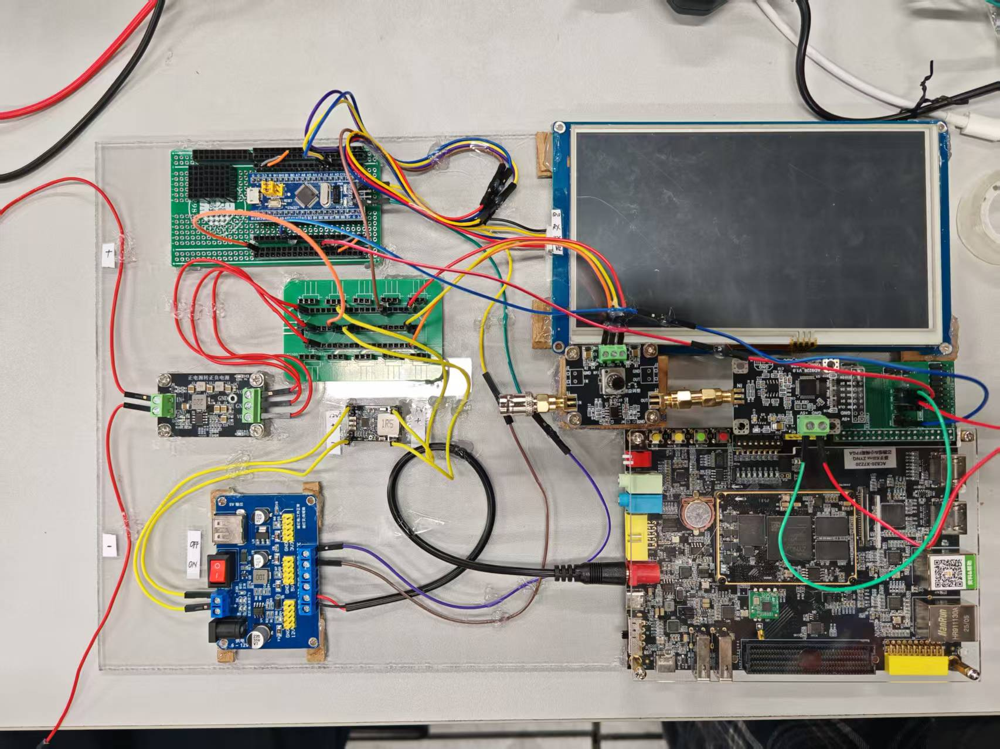
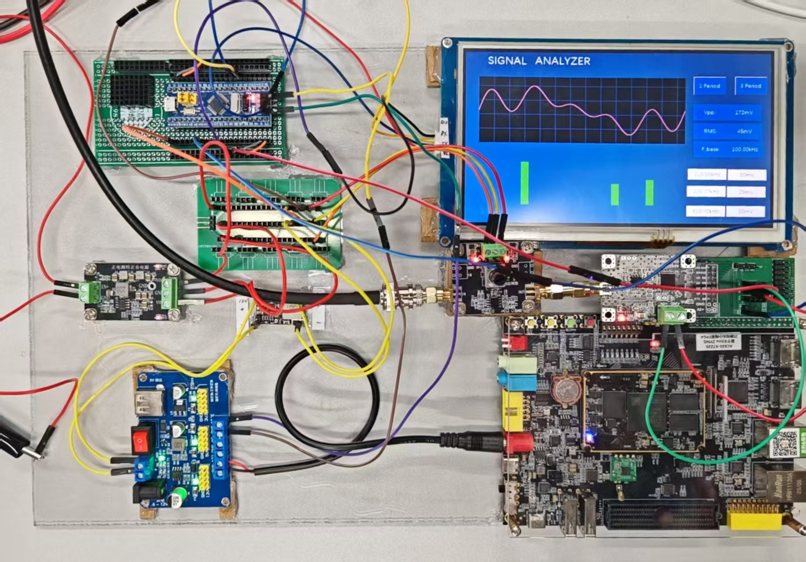

# 2026 NUEDC Problem G - Periodic Signal Measurement and Analysis System

> 🏆 **Award: Provincial First Prize (省一等奖), 2026 National Undergraduate Electronics Design Contest**

2026 年全国大学生电子设计竞赛 G 题——**周期信号测量分析装置**。

本项目基于 **STM32F103 + Zynq-7020 FPGA** 实现周期信号采集、处理、频谱分析以及测量结果显示。

## Project Photos

### Hardware System



### Running Demonstration



## Award

- **2026 全国大学生电子设计竞赛**
- **G 题：周期信号测量分析装置**
- **省一等奖 🏆**

## Project Overview

系统主要由 STM32 控制部分、Zynq-7020 FPGA 信号处理部分以及人机交互界面组成。

FPGA 部分负责高速数字信号处理，包括采样数据处理、FFT、频谱特征提取等功能；STM32 部分负责系统控制、数据交互及外围设备管理。

## Hardware Platform

- STM32F103
- Zynq-7020 FPGA
- ADC signal acquisition
- Display / HMI interface
- Custom signal processing system

## FPGA

FPGA 部分使用 Verilog HDL 开发，主要包含：

- ADC data acquisition
- Offset binary conversion
- FIFO data synchronization
- 8192-point FFT processing
- FFT power calculation
- Spectrum analysis
- Peak detection
- Waveform characteristic measurement
- UART communication
- Digital signal processing modules

主要 FPGA 源码位于：

```text
2026G_Zynq7020_FPGA/
```

核心模块包括：

```text
ad9226_clock_capture.v
adc_offset_binary.v
adc_overrange_frame.v
axis_sync_fifo.v
fft_8192_wrapper.v
fft_power_calc.v
fir_output_scale.v
g_fft_8192_core.v
integer_sqrt_u64.v
measurement_uart.v
peak_detector_3.v
spectrum_metrics.v
top_fft_g.v
top_fft_g_board.v
top_fft_sd.v
uart_tx_byte.v
unsigned_divider_48_24.v
waveform_metrics.v
window_8192.v
```

## STM32

STM32 控制程序位于：

```text
2026G_STM32F103/
```

主要负责系统控制、外围设备驱动、数据通信以及测量结果交互。

## Repository Structure

```text
2026_NUEDC_G/
├── 2026G_STM32F103/
│   └── STM32 firmware
├── 2026G_Zynq7020_FPGA/
│   └── FPGA Verilog source code
├── Screen/
│   └── HMI / display resources
├── Fig1.jpg
├── Fig2.jpg
├── G题 周期信号测量分析装置.pdf
└── README.md
```

## Development Tools

- Vivado 2018.3
- Keil MDK
- Verilog HDL
- C
- STM32 Standard Peripheral Library

## Result

本项目完成 2026 全国大学生电子设计竞赛 G 题“周期信号测量分析装置”。

**🏆 获得省一等奖（Provincial First Prize）**

## Notes

This repository contains the main STM32 firmware, FPGA Verilog source code, HMI resources, competition problem statement, project documentation, and demonstration images.